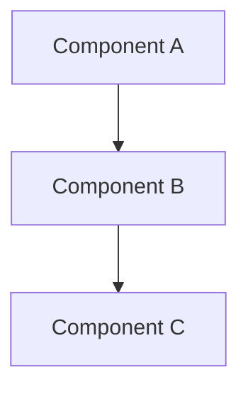
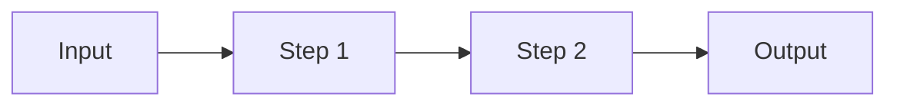

# Architecture — {project-name}

> Generated by the `architecture-explainer` skill · {date}

---

## 1. Project Overview & High-Level Goal

<!-- What problem does this repository solve?
     Who are the primary users or consumers?
     What is the single most important outcome this project produces? -->

**Goal:**

**Users / Consumers:**

**Primary Output:**

---

## 2. Tech Stack

### Core Technologies

| Technology | Role | Version / Notes |
|------------|------|-----------------|
|            |      |                 |

### Key APIs & Frameworks

| Name | Category | Purpose |
|------|----------|---------|
|      |          |         |

### Development Tools

| Tool | Purpose |
|------|---------|
|      |         |

---

## 3. Repository Structure

```
<top-two-level directory tree>
```

| Path | Purpose |
|------|---------|
|      |         |

---

## 4. Architecture

### Components & Responsibilities

| Component | File / Package | Responsibility | Key Interfaces |
|-----------|---------------|----------------|----------------|
|           |               |                |                |

### Component Interaction

<!-- How do components call each other? What is the dependency direction? -->



### Third-Party Integrations

| Integration | Purpose | Entry Point / Call Site |
|-------------|---------|------------------------|
|             |         |                        |

---

## 5. Design Flow & Data Flow

### Primary Flow

<!-- Step-by-step trace of the main operation from entry to output -->

1. **Entry** —
2. **Validation / Parsing** —
3. **Core Logic** —
4. **Output / Side Effects** —



### Secondary Flows

<!-- Optional: error handling path, alternate modes, background jobs -->

---

## 6. Build Process, Commands & Scripts

### Prerequisites

| Requirement | Version | Notes |
|-------------|---------|-------|
|             |         |       |

### Setup

```bash
# Install dependencies
```

### Run / Develop

```bash
# Start the project or run the main script
```

### Test

```bash
# Run the test suite
```

### Build / Package / Release

```bash
# Produce distributable artifacts
```

### Scripts Reference

| Script | Location | Purpose |
|--------|----------|---------|
|        |          |         |

---

## 7. Design Patterns, Conventions & Constraints

### Patterns

- **Pattern name** — description of where and how it is applied

### Conventions

- **Naming** —
- **File organization** —
- **Module boundaries** —

### Constraints

- **Runtime** —
- **Platform** —
- **External dependencies** —

---

## 8. Summary

<!-- 3–5 sentences covering: what the project is, what it does, how it does it,
     and who should read this document. -->
