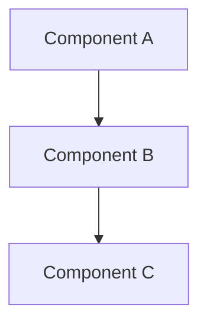
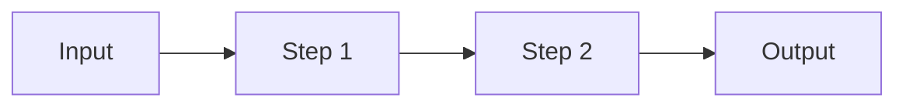
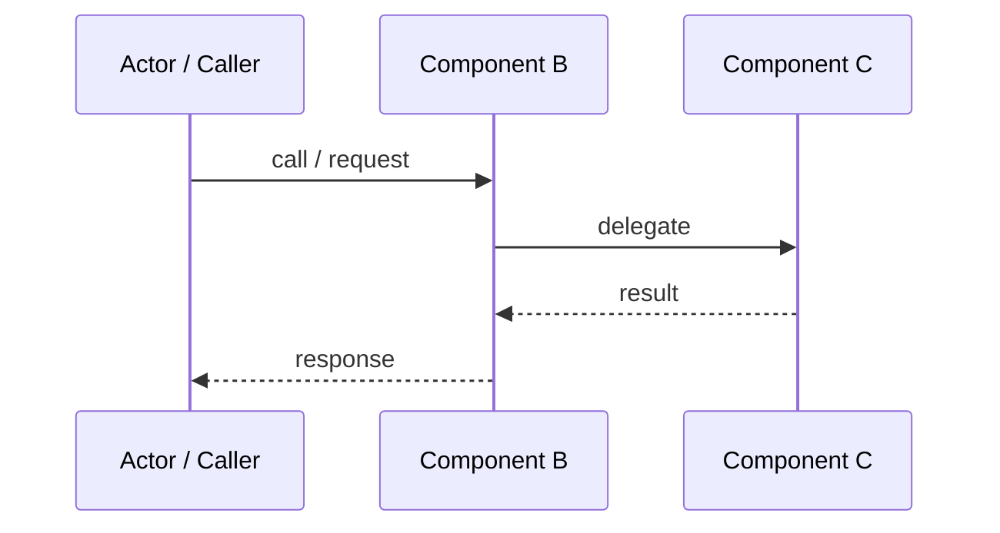

# Architecture — {project-name}

> Generated by ArchLens · {date}

---

## 1. Project Overview

<!-- What problem does this repository solve?
     Who are the primary users or consumers?
     What is the single most important outcome this project produces?
     What does this repo explicitly NOT own? -->

**Goal:**

**Users / Consumers:**

**Primary Output:**

**Scope Boundaries:**

---

## 2. Tech Stack

### Core Technologies

| Technology | Role | Version / Notes |
|------------|------|-----------------|
|            |      |                 |

### Key APIs & Frameworks

| Name | Category | Purpose |
|------|----------|---------|
|      |          |         |

### Development Tools

| Tool | Purpose |
|------|---------|
|      |         |

---

## 3. Repository Structure

```
<top-two-to-three-level directory tree>
```

| Path | Purpose |
|------|---------|
|      |         |

---

## 4. Architecture

<!-- Inline annotations used in this section:
     ⚠️ Requires verification — finding is ambiguous or unconfirmed
     🗑️ Possibly unused — dead code, orphaned module, or unused dependency
     All flagged items are consolidated in §10 Open Questions. -->

### Components & Responsibilities

| Component | File / Package | Responsibility | Key Interfaces | Consumers |
|-----------|---------------|----------------|----------------|-----------|
|           |               |                |                |           |

### Component Interaction

<!-- How do components call each other? What is the dependency direction? -->



### Third-Party Integrations

| Integration | Purpose | Entry Point / Call Site |
|-------------|---------|------------------------|
|             |         |                        |

### Deployment Topology

<!-- Document if Dockerfile, docker-compose.yml, *.tf, *.bicep, or similar infra config is present.
     Omit this subsection if no infra config exists. -->

---

## 5. Data Flow

### Primary Flow

<!-- Step-by-step trace of the main operation from entry to output -->

1. **Entry** —
2. **Validation / Parsing** —
3. **Core Logic** —
4. **Output / Side Effects** —



### Critical Flow — Sequence



### Secondary Flows

<!-- Optional: error handling path, alternate modes, background jobs -->

### Data Models

<!-- Schema or shape only — no full ORM definitions.
     Use a table or fenced code block per model. -->

---

## 6. Build, Run & Scripts

### Prerequisites

| Requirement | Version | Notes |
|-------------|---------|-------|
|             |         |       |

### Setup

```bash
# Install dependencies
```

### Run / Develop

```bash
# Start the project or run the main script
```

### Test

```bash
# Run the test suite
```

### Build / Package / Release

```bash
# Produce distributable artifacts
```

### Scripts Reference

| Script | Location | Purpose |
|--------|----------|---------|
|        |          |         |

### Environment Variables

| Variable | Required | Description |
|----------|----------|-------------|
|          |          |             |

---

## 7. Design Patterns & Conventions

### Patterns

- **Pattern name** — description of where and how it is applied

### Conventions

- **Naming** —
- **File organization** —
- **Module boundaries** —
- **Error handling** —

### Constraints

- **Runtime** —
- **Platform** —
- **External dependencies** —

---

## 8. Dependencies & Environment

### Runtime Dependencies

| Package | Group | Version | Purpose |
|---------|-------|---------|---------|
|         |       |         |         |

### Minimum Requirements

| Requirement | Minimum Version | Notes |
|-------------|-----------------|-------|
|             |                 |       |

### External Service Dependencies

| Service | Type | Purpose |
|---------|------|---------|
|         |      |         |

---

## 9. Changelog

<!-- UPDATE MODE only — inserted by ArchLens on incremental runs. Omit on initial run. -->

<!--
### {mmddyyyy} — Updated by ArchLens
- [Changed] ...
- [Added] ...
- [Removed] ...
- [Flagged] ...
-->

---

## 10. Open Questions

<!-- Consolidated list of all ⚠️ Requires verification and 🗑️ Possibly unused items
     surfaced during analysis. Remove items once resolved. -->

---

## 11. Summary

<!-- 3–5 sentences covering: what the project is, what it does, how it does it,
     and who should read this document. Audience: product owners, new engineers. -->
